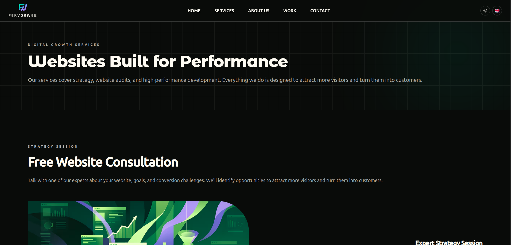
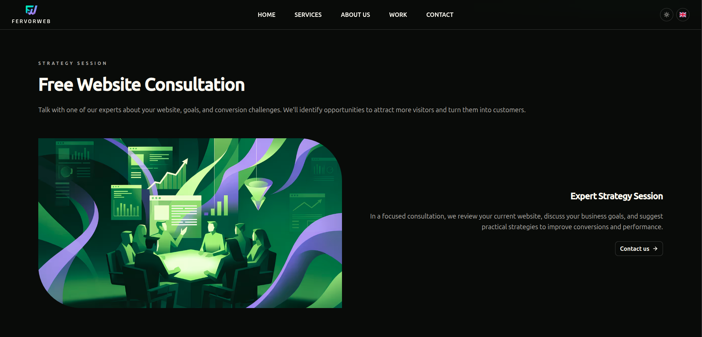
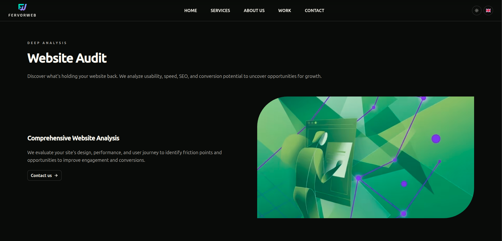
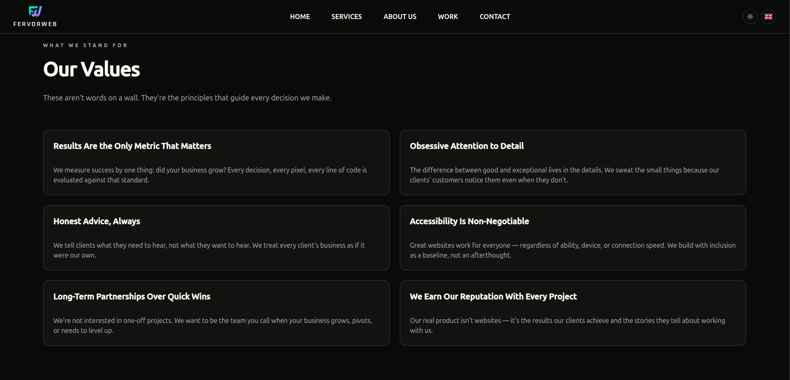
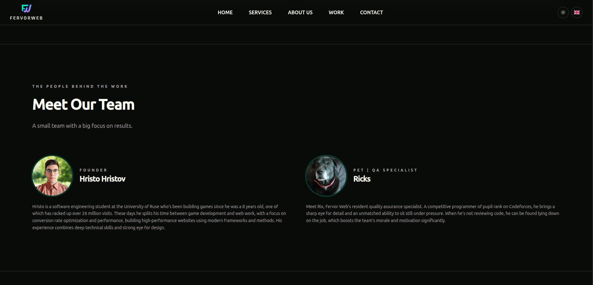
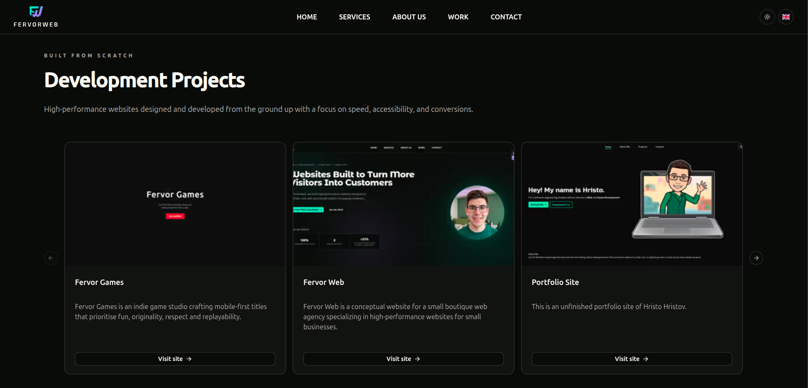
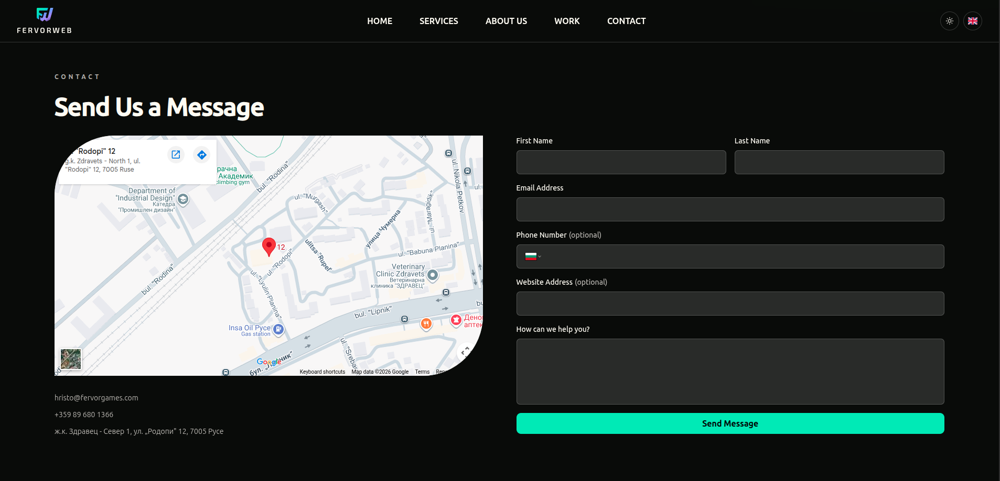

# Fervor Web
[](https://github.com/Milkeles/FervorWeb/actions)
[](LICENSE)
[](https://github.com/Milkeles/FervorWeb/issues)
[](https://github.com/Milkeles/FervorWeb/pulls)
[](https://github.com/Milkeles/FervorWeb/releases/latest)

## Table of Contents
- [Introduction](#introduction)
- [Pages](#pages)
- [Installation and Setup](#installation-and-setup)
- [Documentation References](#documentation-references)
- [License](#license)

---

## Introduction
Fervor Web is a conceptual website for a small boutique web agency specializing in high-performance websites for small businesses. We build customer-centric websites focused on high performance, conversion rate, and SEO, all delivered quickly and maintained affordably through a straightforward subscription model.

This repository is a class project for Web Design, built with TypeScript, React, shadcn, and Tailwind CSS and original photography.

## Pages
- Home: Hero section, value proposition, and call to action.
- Services: Description and subscription model.
- Work: Portfolio of example projects and case studies.
- About: The agency's story, approach, and values.
- Contact: Inquiry forms and booking.

### Screenshots
#### Homepage
| Dark Theme | Light Theme | Roadmap and Footer |
|----------|----------|------|
|  |  |  |

#### Services
| Landing | Left Aligned Service | Right Aligned Service |
|----------|----------|------|
|  |  |  |
#### About
| Values | Team |
|----------|----------|
|  |  |
#### Work and Contact
| Work Page | Contact Page |
|----------|----------|
|  |  |

## Installation and Setup
```bash
# Clone the repository
git clone https://github.com/Milkeles/FervorWeb.git
cd FervorWeb

# Install dependencies
npm install

# Start the development server
npm run dev

# Start Storybook (component documentation)
npm run storybook
```

## Documentation References
- [Visual Style Guide](docs/visual-style-guide.md)
- [Technical Design Document](docs/technical-design.md)
- [Configuration Management Plan](docs/configuration-management.md)
- Component Library (Storybook) – run locally with `npm run storybook`

*Note: Some documents typically found in a full-stack project are intentionally excluded due to the frontend-focused nature of the project, while others not usually versioned in a repository are included for class purposes.*

## License
[MIT](/LICENSE)