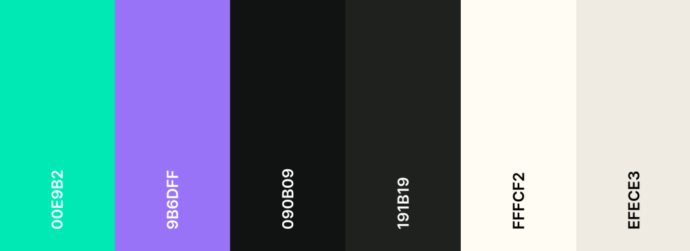
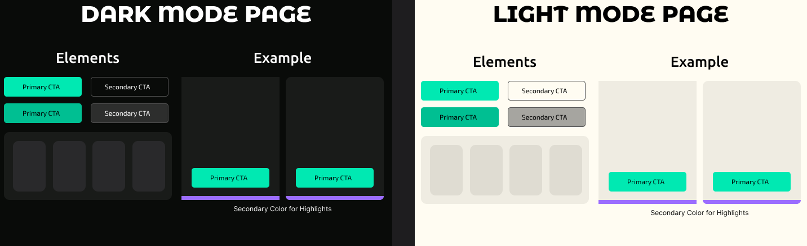

# Visual Style Guide
> Document ID: FW-VSG-01032026
>
> Current Version: 1.1
>
> Date: 02.03.2026
>
> Organisation: University of Ruse "Angel Kanchev"
>
> Department: IIT
>
> Author(s): H. Hristov
>
> Reviewer(s): M. Dzurov
>
> Confidentiality: Internal

## Table of Contents
- [Introduction](#introduction)
- [Color Palette](#color-palette)
- [Typography](#typography)
- [Components and Styling](#components-and-styling)
- [Accessibility](#accessibility)

---

## Introduction
This style guide defines the visual standards that ensure a consistent and professional user experience across the platform.

### Document Purpose
This document establishes the visual design standards and guidelines for the website of Fervor Web.
It serves as a reference for maintaining visual consistency across all user interface components.
This helps to ensure that every element of the system reflects the brand identity of the company and adheres to user experience principles and standards.

### Document Scope
The guidelines outlined in this document apply to all front-end interface elements of the website.
Below, we outline the typography, color usage, UI components size and layout patterns.
This document is intended for the designers and developers working on the website of Fervor Web.
The visual language aims to communicate clearly the purpose of the website and ensure clients about the quality of our services, that we seek to build high performance, conversion-focused, and SEO-optimized websites, delivered quickly and reliably.

## Color Palette
The chosen color palette seeks to communicate reliability, creativity and have sufficient contrast ratio to meet the accessibility requirements.

## Typography
The chosen fonts seek to be modern and reflect the brand identity, while also supporting both latin and cyrillic character set in order to adhere to the course requirements.

- Titles - Montserrat Alternates
- Headings - Ubuntu
- Normal Text - Exo 2

All three fonts are modern looking and geometric, creating a feel of creativity and 

## Components and Styling
### Minimum Text Size
- Headings: 28-24-20 px
- Normal text: 16 px
- Small text: 14 px

### Text Style
- Headings: Bold 700
- Bold/Strong text and Buttons: Medium 500
- Normal text: Regular 400

### Spacing
- Related elements: 8 px
- Normal spacing: 16 px
- Groups: 24 px
- Sections: 32 px
- Button padding: 12 24 px
- Sections: 32 px

### Shapes and colors
Elements throughout the site should have primarily small corner radius (14-10-8px) to ensure modern looks.
However, variety and using sharp edges and geometric shapes for style is also permitted.

The primary color, emerald green ``00E9B2`` is to be used for call-to-action buttons or very important elements, while other shades of green may appear throughtout to maintain the green theme of the website.
Secondary buttons should use colors that don't clash with green, such as gray.
As an alternative for variety, the accent color ``9B6DFF`` may also be used sparsely to highlight key elements.

***Note**: Small deviations from the established standards are permitted, only if consistency is maintained throughout the website. And the accessibility standards outlined below are met.*

## Accessibility
Accessibility is ensured through well-chosen colors with contrast that meets the recommended according to WGAG 2.1, sufficiently large element sizes, as well as by defining standard behavior so that the system can be predictable.
Deviations from the rules outlined above must also adhere to those contrast and size standards.

The website must also support keyboard navigation and contain area labels for people with disabilities and screen readers.

